# 421-solver

## Rules

I call this the **421 dice game 2-player 1-chip variant**.  

The game is played with 3 six-sided dice :game_die::game_die::game_die:.  
The goal is to have the better combination.  

Ok, so it goes like this:

- Roll the three dice :game_die::game_die::game_die: then **STOP** or *CONTINUE*
- Keep any number of dice and reroll the rest, then **STOP** or *CONTINUE*
- Keep any number of dice and reroll the rest, then **STOP**

Now, the same applies to the second-player, except they **must** stop at the same step as the first-player did. (i.e., being allowed 0, 1 or 2 rerolls)  
At the end whoever has the better combo wins:

| Ranking                                                   |     |
| :-------------------------------------------------------: | --  |
| 421                                                       |     |
| 111                                                       |     |
| **6**11, **6**66, **5**11, **5**55, ..., **2**11, **2**22 | *   |
| 654, 543, 432, 321                                        | **  |
| 665, 664, ..., 322, 221                                   | *** |

\*  pattern is (**X**11, **XXX**) repeating in decreasing order of X, with the exception of X=1 being better.  
\*\* straight.  
\*\*\* just highest roll.  

> [!NOTE]
> I will use this canonical representation for combos:  
> Ordering dice with bigger digit at the left ($xyz \enspace s.t. \enspace x \geq y \geq z$)

## Motivation

In my play group, we sometimes use this game as a replacement of coin-flipping when picking between two people.  
Now, the issue is that 421 is an asymmetrical game.  
So, it begs the question: which player is favored, the first or the second?  

Intuitively, there are strong arguments for both side:  

- The first-player gets to *set the rules* in a sense (the number of rerolls allowed during the game). And they do so midstep, knowing what they are currently holding.
- The second-player is *the last to speak*, aware of exactly what they have to beat in order to win. Therefore taking risk or not accordingly.  

My guess was that the second-player was advantaged. Having played a fair share of poker, my rationale was: this is the equivalent of playing in-postion, which is a massive advantage as opposed to being able set the price by donking out-of-positon..  

spoiler

> $\Huge I \quad \Huge WAS \quad \Huge WRONG$

## Mathematical model

Every function is seen from the **first-player's perspective**.  
Let $u(r_1,r_2)$ be the terminal utility function for a given first-player combo $r_1$  and second-player combo $r_2$.  
Let $A$ be the set of all legal actions. For each die whether it's kept or rerolled $|A|=2^3$.  
Let $X_{r_ia}$ be the discrete random variable of a throw given optional action $a \in A$ applied to prior combo $r_i$.  
Let $g(r_1,r_2,t)$ be the win rate of combo $r_2$ with $t$ **rerolls left to use** against first-player final combo $r_1$.  
Let $f(r_1,t)$ be the win rate of combo $r_1$ with $t$ **rerolls already used**.  

$`(1) \qquad g(r_1,r_2,0)=u(r_1,r_2)`$  

$`(2) \qquad g(r_1,r_2,t)=\min_{a}^{A}\mathbb{E}[g(r_1,X_{r_2a},t-1)]`$  

$`(3) \qquad f(r_1,2)=\mathbb{E}[g(r_1,X,2)]`$  

$`(4) \qquad f(r_1,t)=\max \begin{cases} \mathbb{E}[g(r_1,X,t)] \\ max_{a}^{A}\mathbb{E}[f(X_{r_1a},t+1)] \end{cases}`$  

The reward is the terminal utility function at the end of the game, which is $(1)$ second-player not having any reroll left to use.  
When we do have some, we choose the "best" action and decrease rerolls counter $(2)$. Since it's **first-player's perspective**, "best" for second-player is minimizing.  
The first-player must stop $(3)$ because of max reroll cap at 2 by rules.  
The reroll counter $t$ is increased and then decreased so that $g$ and $f$ have the same amount of recursion $(4)$. It also captures the idea of whether it's worth using a reroll to impove or just passing over to the second-player.  

## Visual

```mermaid
graph LR
    BEGIN@{shape: sm-circ}                     --> |"r=🎲🎲🎲                                 "| f0
    f0{"f(r,0)"}                               --> |"r<sub>2</sub>''=🎲🎲🎲                   "| g0
    f1{"f(r',1)"}                              --> |"r<sub>2</sub>'=🎲🎲🎲                    "| g1
    f2{"f(r'',2)"}                             --> |"r<sub>2</sub>=🎲🎲🎲                     "| g2
    f0                                         --> |"r'=X<sub>ra</sub>                          "| f1
    f1                                         --> |"r''=X<sub>r'a</sub>                        "| f2
    g2(("g(r<sub>1</sub>,r<sub>2</sub>,2)"))   --> |"r<sub>2</sub>'=X<sub>r<sub>2</sub>a<sub>   "| g1
    g1(("g(r<sub>1</sub>,r<sub>2</sub>',1)"))  --> |"r<sub>2</sub>''=X<sub>r<sub>2</sub>'a</sub>"| g0
    g0(("g(r<sub>1</sub>,r<sub>2</sub>'',0)")) --> |"u(r<sub>1</sub>,r<sub>2</sub></sub>'')     "| END@{shape: framed-circle}
```

[RemindMe! when fixed](https://github.com/orgs/community/discussions/149217)

## Results

Under optimal play, the **first-player** has an expected win rate of $`\mathbb{E}[f(X, 0)] \approx 60.00\%`$[^1].  

Lines are current combo (sorted by ranking).  
Columns are how many reroll already used.  
Corresponding cell will give expected win rate given the best action.  
Actions shows which die should be kept and _ denotes a reroll.

| $`f(r,t)`$        | $`t=0`$                   | $`t=1`$                   | $`t=2`$                                                      |
| :-------------: | :---------------------: | :---------------------: | :--------------------------------------------------------: |
| $`r=421`$         | $`98.61\% \bigm\vert 421`$    | $`94.23\% \bigm\vert 421`$    | $`88.59\% \bigm\vert 421`$ [:next_track_button:](results/421.md) |
| $`r=111`$         | $`96.99\% \bigm\vert 111`$    | $`87.94\% \bigm\vert 111`$    | $`76.63\% \bigm\vert 111`$ [:next_track_button:](results/111.md) |
| $`r=611`$         | $`96.06\% \bigm\vert 611`$    | $`85.80\% \bigm\vert 611`$    | $`73.44\% \bigm\vert 611`$ [:next_track_button:](results/611.md) |
| $`r=666`$         | $`95.14\% \bigm\vert 666`$    | $`83.60\% \bigm\vert 666`$    | $`70.45\% \bigm\vert 666`$ [:next_track_button:](results/666.md) |
| $`r=511`$         | $`94.21\% \bigm\vert 511`$    | $`82.02\% \bigm\vert 511`$    | $`67.98\% \bigm\vert 511`$ [:next_track_button:](results/511.md) |
| $`r=555`$         | $`93.29\% \bigm\vert 555`$    | $`79.42\% \bigm\vert 555`$    | $`63.91\% \bigm\vert 555`$ [:next_track_button:](results/555.md) |
| $`r=411`$         | $`92.36\% \bigm\vert 411`$    | $`76.90\% \bigm\vert 411`$    | $`60.82\% \bigm\vert 411`$ [:next_track_button:](results/411.md) |
| $`r=444`$         | $`91.44\% \bigm\vert 444`$    | $`73.99\% \bigm\vert 444`$    | $`56.60\% \bigm\vert 444`$ [:next_track_button:](results/444.md) |
| $`r=311`$         | $`90.51\% \bigm\vert 311`$    | $`72.30\% \bigm\vert 311`$    | $`54.82\% \bigm\vert 311`$ [:next_track_button:](results/311.md) |
| $`r=333`$         | $`89.58\% \bigm\vert 333`$    | $`70.84\% \bigm\vert 333`$    | $`53.44\% \bigm\vert 333`$ [:next_track_button:](results/333.md) |
| $`r=211`$         | $`88.66\% \bigm\vert 211`$    | $`69.38\% \bigm\vert 211`$    | $`52.03\% \bigm\vert 211`$ [:next_track_button:](results/211.md) |
| $`r=222`$         | $`87.73\% \bigm\vert 222`$    | $`67.98\% \bigm\vert 222`$    | $`50.64\% \bigm\vert 222`$ [:next_track_button:](results/222.md) |
| $`r=654`$         | $`86.11\% \bigm\vert 654`$    | $`66.24\% \bigm\vert 654`$    | $`49.38\% \bigm\vert 654`$ [:next_track_button:](results/654.md) |
| $`r=543`$         | $`83.33\% \bigm\vert 543`$    | $`62.54\% \bigm\vert 543`$    | $`45.10\% \bigm\vert 543`$ [:next_track_button:](results/543.md) |
| $`r=432`$         | $`80.56\% \bigm\vert 432`$    | $`58.29\% \bigm\vert 432`$    | $`40.47\% \bigm\vert 432`$ [:next_track_button:](results/432.md) |
| $`r=321`$         | $`77.78\% \bigm\vert 321`$    | $`53.51\% \bigm\vert 321`$    | $`35.58\% \bigm\vert 321`$ [:next_track_button:](results/321.md) |
| $`r=665`$         | $`75.69\% \bigm\vert 665`$    | $`49.40\% \bigm\vert 665`$    | $`30.90\% \bigm\vert 665`$ [:next_track_button:](results/665.md) |
| $`r=664`$         | $`74.31\% \bigm\vert 664`$    | $`47.22\% \bigm\vert 664`$    | $`29.12\% \bigm\vert 664`$ [:next_track_button:](results/664.md) |
| $`r=663`$         | $`72.92\% \bigm\vert 663`$    | $`45.66\% \bigm\vert 663`$    | $`27.67\% \bigm\vert 663`$ [:next_track_button:](results/663.md) |
| $`r=662`$         | $`71.53\% \bigm\vert 662`$    | $`44.44\% \bigm\vert 662`$    | $`26.43\% \bigm\vert 662`$ [:next_track_button:](results/662.md) |
| $`r=661`$         | $`70.14\% \bigm\vert 661`$    | $`42.88\% \bigm\vert 661`$    | $`25.01\% \bigm\vert 661`$ [:next_track_button:](results/661.md) |
| $`r=655`$         | $`68.75\% \bigm\vert 655`$    | $`41.38\% \bigm\vert 655`$    | $`23.97\% \bigm\vert 655`$ [:next_track_button:](results/655.md) |
| $`r=653`$         | $`66.67\% \bigm\vert 653`$    | $`38.73\% \bigm\vert 653`$    | $`21.10\% \bigm\vert 653`$ [:next_track_button:](results/653.md) |
| $`r=652`$         | $`63.89\% \bigm\vert 652`$    | $`35.03\% \bigm\vert 652`$    | $`17.68\% \bigm\vert 652`$ [:next_track_button:](results/652.md) |
| $`r=651`$         | $`61.11\% \bigm\vert 651`$    | $`31.75\% \bigm\vert 651`$    | $`15.21\% \bigm\vert 651`$ [:next_track_button:](results/651.md) |
| $`r=644`$         | $`59.03\% \bigm\vert 644`$    | $`29.75\% \bigm\vert 644`$    | $`14.00\% \bigm\vert 644`$ [:next_track_button:](results/644.md) |
| $`r=643`$         | $`56.94\% \bigm\vert 643`$    | $`28.01\% \bigm\vert 643`$    | $`12.74\% \bigm\vert 643`$ [:next_track_button:](results/643.md) |
| $`r=642`$         | $`54.17\% \bigm\vert 642`$    | $`25.04\% \bigm\vert 642`$    | $`10.66\% \bigm\vert 642`$ [:next_track_button:](results/642.md) |
| $`r=641`$         | $`51.39\% \bigm\vert 641`$    | $`29.15\% \bigm\vert \_\_1`$  | $`8.79\% \bigm\vert 641`$ [:next_track_button:](results/641.md)  |
| $`r=633`$         | $`49.31\% \bigm\vert 633`$    | $`21.77\% \bigm\vert \_\_6`$  | $`7.91\% \bigm\vert 633`$ [:next_track_button:](results/633.md)  |
| $`r=632`$         | $`47.22\% \bigm\vert 632`$    | $`21.77\% \bigm\vert \_\_6`$  | $`7.43\% \bigm\vert 632`$ [:next_track_button:](results/632.md)  |
| $`r=631`$         | $`49.81\% \bigm\vert \_\_1`$  | $`29.15\% \bigm\vert \_\_1`$  | $`6.48\% \bigm\vert 631`$ [:next_track_button:](results/631.md)  |
| $`r=622`$         | $`42.36\% \bigm\vert 622`$    | $`21.77\% \bigm\vert \_\_6`$  | $`5.85\% \bigm\vert 622`$ [:next_track_button:](results/622.md)  |
| $`r=621`$         | $`51.35\% \bigm\vert \_21`$   | $`30.33\% \bigm\vert \_21`$   | $`5.38\% \bigm\vert 621`$ [:next_track_button:](results/621.md)  |
| $`r=554`$         | $`38.80\% \bigm\vert \_\_4`$  | $`19.69\% \bigm\vert \_\_4`$  | $`4.97\% \bigm\vert 554`$ [:next_track_button:](results/554.md)  |
| $`r=553`$         | $`38.54\% \bigm\vert \_\_\_`$ | $`19.31\% \bigm\vert \_\_\_`$ | $`4.61\% \bigm\vert 553`$ [:next_track_button:](results/553.md)  |
| $`r=552`$         | $`38.54\% \bigm\vert \_\_\_`$ | $`19.31\% \bigm\vert \_\_\_`$ | $`4.09\% \bigm\vert 552`$ [:next_track_button:](results/552.md)  |
| $`r=551`$         | $`49.81\% \bigm\vert \_\_1`$  | $`29.15\% \bigm\vert \_\_1`$  | $`3.56\% \bigm\vert 551`$ [:next_track_button:](results/551.md)  |
| $`r=544`$         | $`38.80\% \bigm\vert \_\_4`$  | $`19.69\% \bigm\vert \_\_4`$  | $`3.33\% \bigm\vert 544`$ [:next_track_button:](results/544.md)  |
| $`r=542`$         | $`41.50\% \bigm\vert \_42`$   | $`23.82\% \bigm\vert \_42`$   | $`2.90\% \bigm\vert 542`$ [:next_track_button:](results/542.md)  |
| $`r=541`$         | $`49.81\% \bigm\vert \_\_1`$  | $`29.15\% \bigm\vert \_\_1`$  | $`1.80\% \bigm\vert 541`$ [:next_track_button:](results/541.md)  |
| $`r=533`$         | $`38.54\% \bigm\vert \_\_\_`$ | $`19.31\% \bigm\vert \_\_\_`$ | $`1.43\% \bigm\vert 533`$ [:next_track_button:](results/533.md)  |
| $`r=532`$         | $`38.54\% \bigm\vert \_\_\_`$ | $`19.31\% \bigm\vert \_\_\_`$ | $`1.11\% \bigm\vert 532`$ [:next_track_button:](results/532.md)  |
| $`r=531`$         | $`49.81\% \bigm\vert \_\_1`$  | $`29.15\% \bigm\vert \_\_1`$  | $`0.69\% \bigm\vert 531`$ [:next_track_button:](results/531.md)  |
| $`r=522`$         | $`38.54\% \bigm\vert \_\_\_`$ | $`19.31\% \bigm\vert \_\_\_`$ | $`0.49\% \bigm\vert 522`$ [:next_track_button:](results/522.md)  |
| $`r=521`$         | $`51.35\% \bigm\vert \_21`$   | $`30.33\% \bigm\vert \_21`$   | $`0.39\% \bigm\vert 521`$ [:next_track_button:](results/521.md)  |
| $`r=443`$         | $`38.80\% \bigm\vert \_\_4`$  | $`19.69\% \bigm\vert \_\_4`$  | $`0.32\% \bigm\vert 443`$ [:next_track_button:](results/443.md)  |
| $`r=442`$         | $`41.50\% \bigm\vert \_42`$   | $`23.82\% \bigm\vert \_42`$   | $`0.25\% \bigm\vert 442`$ [:next_track_button:](results/442.md)  |
| $`r=441`$         | $`49.81\% \bigm\vert \_\_1`$  | $`29.15\% \bigm\vert \_\_1`$  | $`0.18\% \bigm\vert 441`$ [:next_track_button:](results/441.md)  |
| $`r=433`$         | $`38.80\% \bigm\vert \_\_4`$  | $`19.69\% \bigm\vert \_\_4`$  | $`0.12\% \bigm\vert 433`$ [:next_track_button:](results/433.md)  |
| $`r=431`$         | $`49.81\% \bigm\vert \_\_1`$  | $`29.15\% \bigm\vert \_\_1`$  | $`0.06\% \bigm\vert 431`$ [:next_track_button:](results/431.md)  |
| $`r=422`$         | $`41.50\% \bigm\vert \_42`$   | $`23.82\% \bigm\vert \_42`$   | $`0.02\% \bigm\vert 422`$ [:next_track_button:](results/422.md)  |
| $`r=332`$         | $`38.54\% \bigm\vert \_\_\_`$ | $`19.31\% \bigm\vert \_\_\_`$ | $`0.02\% \bigm\vert 332`$ [:next_track_button:](results/332.md)  |
| $`r=331`$         | $`49.81\% \bigm\vert \_\_1`$  | $`29.15\% \bigm\vert \_\_1`$  | $`0.01\% \bigm\vert 331`$ [:next_track_button:](results/331.md)  |
| $`r=322`$         | $`38.54\% \bigm\vert \_\_\_`$ | $`19.31\% \bigm\vert \_\_\_`$ | $`0.00\% \bigm\vert 322`$ [:next_track_button:](results/322.md)  |
| $`r=221`$         | $`51.35\% \bigm\vert \_21`$   | $`30.33\% \bigm\vert \_21`$   | $`0.00\% \bigm\vert 221`$ [:next_track_button:](results/221.md)  |

Click on the *next track arrow* to follow through second-player best response

## Analysis

By factoring a little bit we can boiled down the whole first-player strategy to this set of memorizable ordered rules:  

- Continue with $`\_\_1`$ when $`r=631`$  
- Stop on $`\geq 642`$  
- Stop on $`\geq 622`$ when $`t=1`$  
- Continue with $`\_21`$  
- Continue with $`\_\_1`$  
- Continue with $`\_42`$  
- Continue with $`\_\_6`$  
- Continue with $`\_\_4`$  
- Otherwise $`\_\_\_`$ reroll everything

A few other interesting observation that the strategy teaches us:

- Never go for open-ended straight draw!  
  For instance, the best candidate being $`\_54=36.86\%`$ at $`t=0`$.  
  But it's simply dominated by $`\_\_4=38.80\%`$ and even $`\_\_\_=38.54\%`$!
- Don't try to improve a $`211`$ (It's almost a $`10\%`$ loss)
- $`\_21`$ is much better than $`\_42`$ (slighlty less than $`10\%`$ again) because of the good backdoors when missing the nuts.

## What's next

- [ ] Format and analyse second-player strategy
- [ ] Tweak the rules until we get close to a 50/50 game with a more interesting first-player strategy ?

## Acknowledgment

> [!TIP]
> Armel, if you are reading this, you got to stop letting me go first  
> I have the above strategy nailed down and will take my $`20\%`$ edge :hand_over_mouth:  

[^1]: 60.0044373496605%
